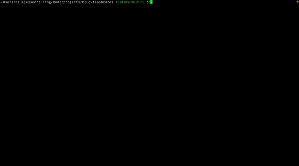
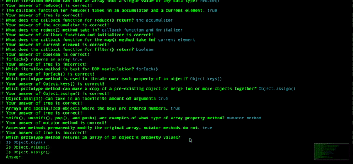

# Blue's Flashcards!

## Table of Contents
- [Introduction](#introduction)
- [Technologies](#technologies)
- [Set Up](#set-up)
- [Features](#features)
- [Future Features](#future-features)
- [Contributors](#contributors)
- [Project Specifications](#project-specifications)
- [Resources](#resources)

### Introduction
Lets test your knowledge of javascript with this flashcard game!  We will use our trusty terminal to play.

### Technologies
- JavaScript

### Set Up
1.  Clone this [repository](https://github.com/BlueJessen/blue-flashcards).
2. `cd` into the directory.
3. Run `node index.html`.

### Features

- User can use the answer number or arrow keys to scroll through options
- Press enter to select your choice
- When the answer is incorrect it will let you know!
  
- If you score less than a 90% on the round the game takes you through again.
  
- Crowd in back cheers when a player wins

### Future Features

- Have a report card of which questions that were answered incorrectly
- Have user retry incorrect questions
- Create a visual representation of the game

### Contributors

- [Blue Nealis](https://www.linkedin.com/in/blue-nealis/)

### Project Specifications

- Project specs can be found [here](https://frontend.turing.edu/projects/flash-cards.html).

### Resources

- [MDN Documentation](https://developer.mozilla.org/en-US/)
- [W3 Schools](https://www.w3schools.com/)
- My Cohorts Support and Love
